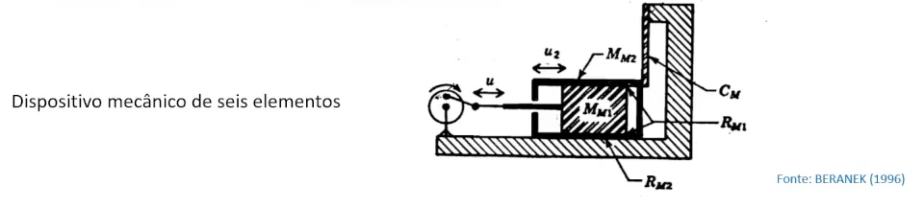
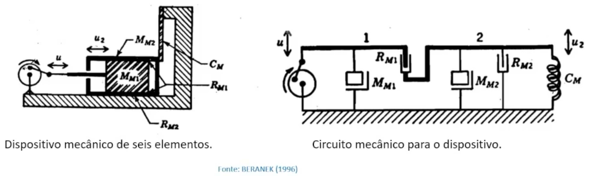
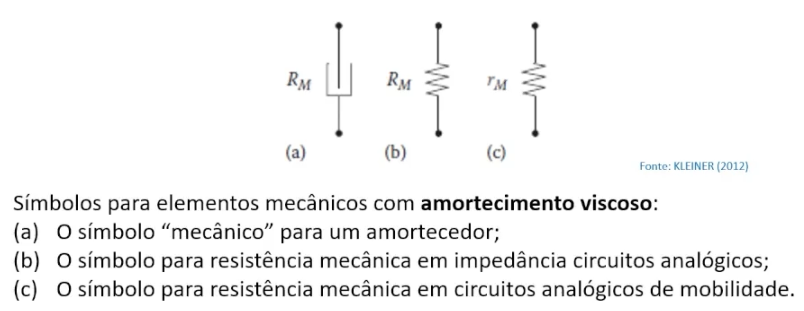
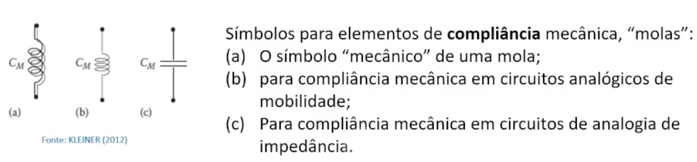
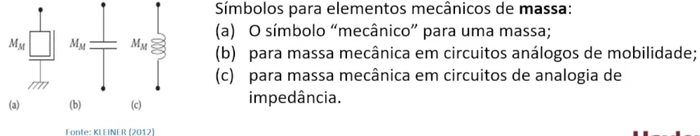
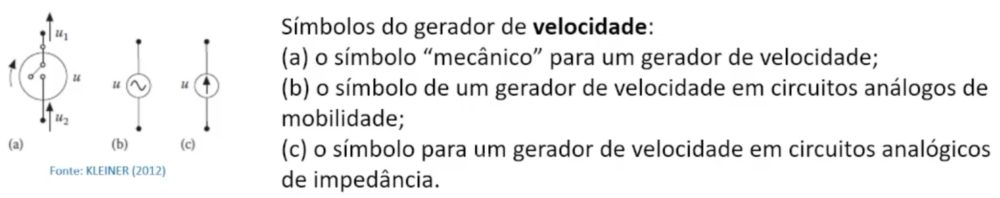
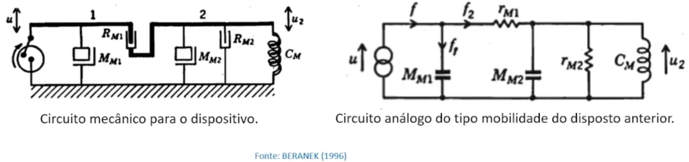

# Exemplo de Força Gerada pelo Gerador

## Descrição do Contexto

- O disposito mecânico da figura consiste em um pistão de Massa $ M_{M1} $ que desliza contra uma superfície oleosa dentro de um cilindro de massa $ M_{M2} $.
-  Este cilindro se desliza, por sua vez, por uma ranhura oleosa cortada em um corpo rígido.
- As resistências (viscosas) ao deslizamento são $ R_{M1} $ e $ R_{M2} $, respectivamente.
- O cilindro é segurado por um elástico de compliância/conformidade $ C_M $.
- O gerador mecânico mantém uma velocidade constante sinusional de frequência angular $ \omega $, cuja magnitude rms é $ u $ em $ \frac m s $.

## Pergunta
- Determine a força $ f $ produzida pelo gerador.

## Solução:
- A força será calculada a partir da análise do circuito analógico do módulo de mobilidade.
- Ou seja:

| Circuitos Elétricos           |  Sistema Mecânico                         |
|-------------------------------|-------------------------------------------|
| XXXXXXXXXXXXX                 | XXXXXXXXXXXXX                             |
| XXXXXXXXXXXXX                 | XXXXXXXXXXXXX                             |
| Voltagem E(t)                 | Forca Aplicada F(t)                       |
| Indutância (L)                | Massa (m)                                 |
| Resistência (R)               | Coeficiente de Armortecimanto Viscoso (c) |
| Inverso da Capacitância (1/C) | Rigidez da Mola (k)                       |

| Circuitos Elétricos   |  Sistema Mecânico   | Tipo de Analogia                          |
|-----------------------|---------------------|-------------------------------------------|
| XXXXXXXXXXXXX         | XXXXXXXXXXXXX       | XXXXXXXXXXXXX                             |
| Corrente Elétrica (i) | Forca Aplicada F(t) | Analogia da mobilidade (do segundo tipo)  |

- Identica-se o seguinte circuito mecânico correspondente:

- Desenvolveu-se o circuito análogo com os seguintes pensamentos:
- O Pistão de massa $ M_1 $ se move devido o gerador de força.
    - Tal movimento foi representado de forma análoga com a barra horizontal 1.
        - Na barra horizontal 1, temos:
            - Uma forca mecânica que gera movimento senoidal com velocidade $ u_1 $
            - A massa $ M_1 $
            - E a ligação com a barra 2
            - Existência de uma resistência mecânica viscosa $ R_{M1} $ com a barra 2
            - Não faltou nada na representação
- O cilindro de massa $ M_2 $ se move devido o movimento do pistão de massa $ M_1 $
    - Tal movimento foi representado de forma análoga com a barra horizontal 2.
        - Na barra horizontal 2, temos:
            - Movimento a partir de ligação vindo da barra 1 onde há uma resistência mecânica viscosa já indicada.
            - A massa $ M_2 $
            - Uma resistência mecânica viscosa vinculada apenas à barra 2, denominada como $ R_{M2} $
            - Um força elástica que gera movimento senoidal com velocidade $ u_2 $
            - Uma compliância/conformidade da mola igual a $ C_M $.
            - Não faltou nada na representação
- 4 elementos da barra 2 têm um terminal com velocidade $ u_2 $:
    - Velocidade da barra 2 na ligação viscosa $ R_{M1} $ com a barra 1.
    - Velocidade da barra 2 na ligação com a massa $ M_{M1} $ .
    - Velocidade da barra 2 na ligação com o elemento resistor $ R_{M2} $
    - Velocidade da barra 2 na ligação com a mola de compliância $ C_M $.
- 5 elmentos têm terminal com velocidade zero:
    - Velocidade do chão na ligação com o gerador de força.
    - Velocidade do chão na ligação, viscosa, com a massa $ M_{M1} $.
    - Velocidade do chão na ligação, viscosa, com a massa $ M_{M2} $.
    - Velocidade do chão na ligação, sem toque, com o elemento resistor $ R_{M2} $
    - Velocidade do chão na ligação com a mola de compliância $ C $.
- Tendo feito o circuito mecânico, agora devemos transformá-lo em um circuito análogo do tipo mobilidade.
    - Devemos trocar os elementos mecânicos por elementos análogos do tipo mobilidade:
- Exemplos:

- O circuito resultante da substituição de seus elementos é igual a:
